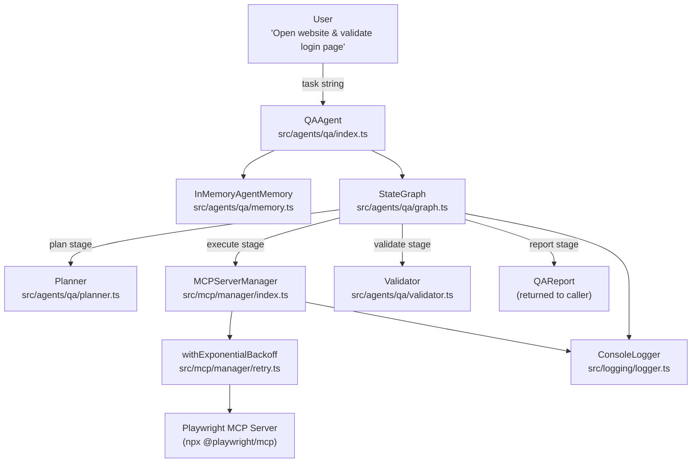
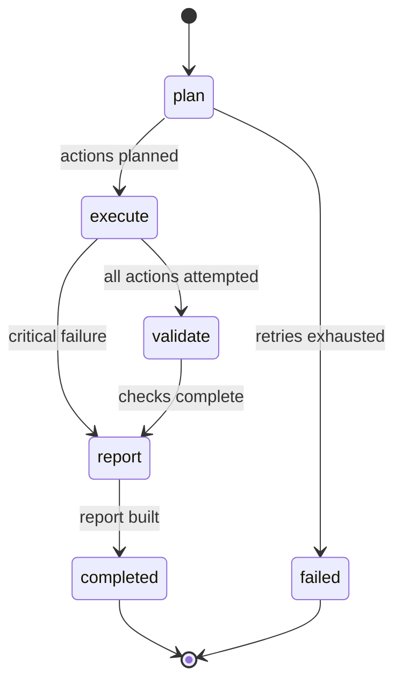
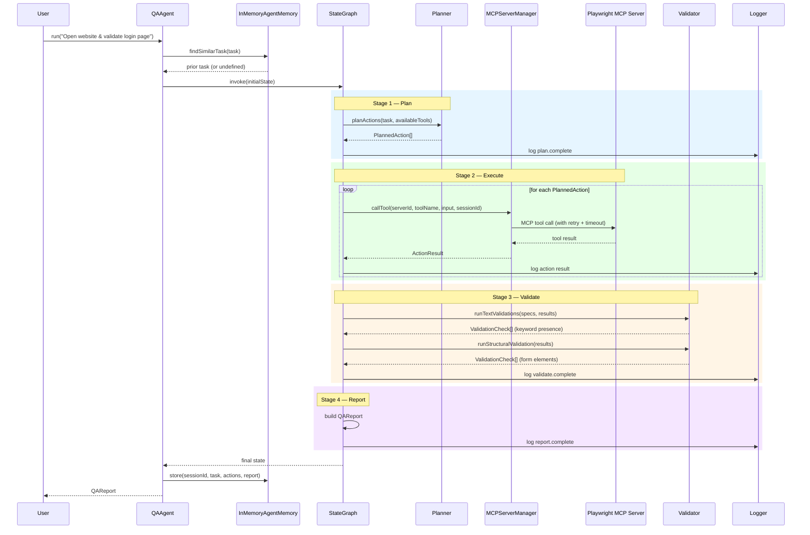
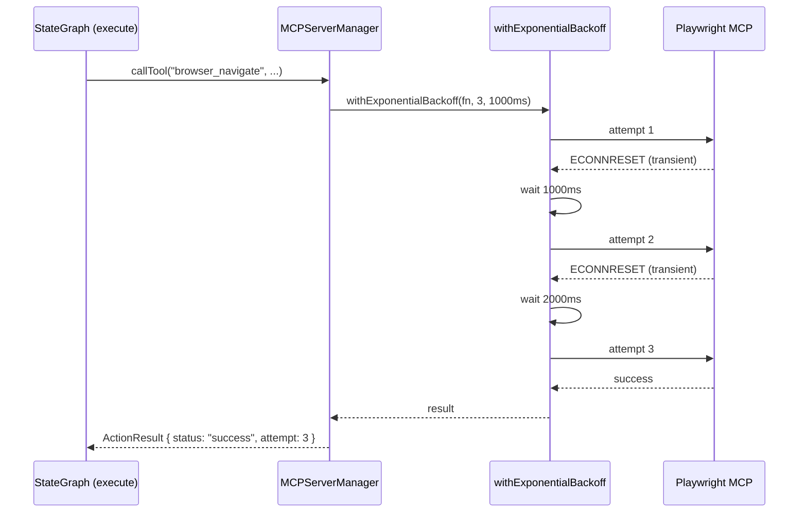

# QA Agent Architecture

## Overview

The QA Agent accepts a natural-language task (e.g. "Open a website and validate
login page"), plans a sequence of browser actions via a LangGraph-style state
machine, executes them through the Playwright MCP Server, validates results, and
returns a structured execution report.

---

## Component Diagram



---

## LangGraph State Machine

The agent runs through four sequential stages. Each stage can retry up to
`maxStageRetries` times (default: 2) before transitioning to `failed`.



### Stage responsibilities

| Stage | Responsibility |
|---|---|
| **plan** | Interprets task, queries available MCP tools, builds `PlannedAction[]`. Checks memory for similar prior tasks. |
| **execute** | Runs each action via `MCPServerManager.callTool()` with retry + timeout. Collects `ActionResult[]`. |
| **validate** | Runs text checks (keyword presence in page content) and structural checks (form field detection via `browser_evaluate`). |
| **report** | Aggregates results into a `QAReport`. Sets `status`: `passed` / `partial` / `failed`. Stores result in memory. |

---

## Sequence Diagram — "Validate Login Page"



---

## Sequence Diagram — Retry Flow



---

## Agent Memory

`InMemoryAgentMemory` is a circular buffer (default max 100 entries).

- **Store**: after every `run()` completion
- **Lookup**: at the start of `plan` stage — finds prior task with ≥50% keyword
  overlap
- **Effect**: the planner logs a `memory.hit` entry when a similar prior task is
  found, which can inform future plan refinement

```
Memory {
  entries: [
    { sessionId, task, actions: PlannedAction[], report: QAReport, timestamp }
    ...
  ]
}
```

---

## Retry Policy

| Layer | Max attempts | Base delay | Transient errors |
|---|---|---|---|
| MCP tool call (`MCPServerManager`) | 3 | 1000ms (doubles: 1s→2s→4s) | ECONNRESET, ETIMEDOUT, ECONNREFUSED, socket hang up, HTTP 503 |
| QA Agent stage | 2 (configurable) | immediate | any `Error` thrown by a stage node |

---

## QAReport Shape

```typescript
interface QAReport {
  sessionId: string;       // UUID per run
  task: string;            // original user input
  status: 'passed' | 'failed' | 'partial';
  startedAt: string;       // ISO8601
  completedAt: string;     // ISO8601
  durationMs: number;
  actions: ActionResult[]; // one per planned action
  validations: ValidationCheck[];
  summary: string;         // human-readable one-liner
  errors: string[];        // stage/action error messages
}
```

**Status rules:**
- `passed` — all actions succeeded AND all validations passed AND no errors
- `failed` — all actions failed OR (errors present AND no validations passed)
- `partial` — some actions/validations passed, some failed

---

## File Structure

```
src/agents/qa/
├── index.ts       QAAgent — entry point, stage orchestration, memory store
├── types.ts       All QA-specific TypeScript interfaces
├── memory.ts      InMemoryAgentMemory — circular buffer with similarity search
├── planner.ts     Task → PlannedAction[] (keyword-based tool selection)
├── graph.ts       Four stage nodes: plan / execute / validate / report
├── validator.ts   Text + structural validation of execution results
└── demo.ts        Runnable demo script
```
