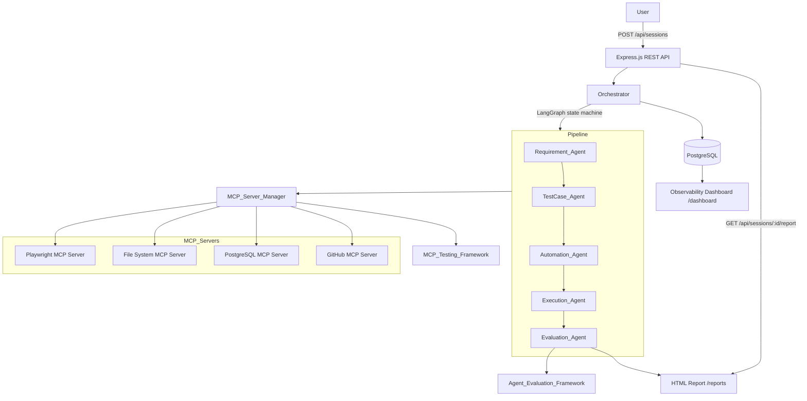
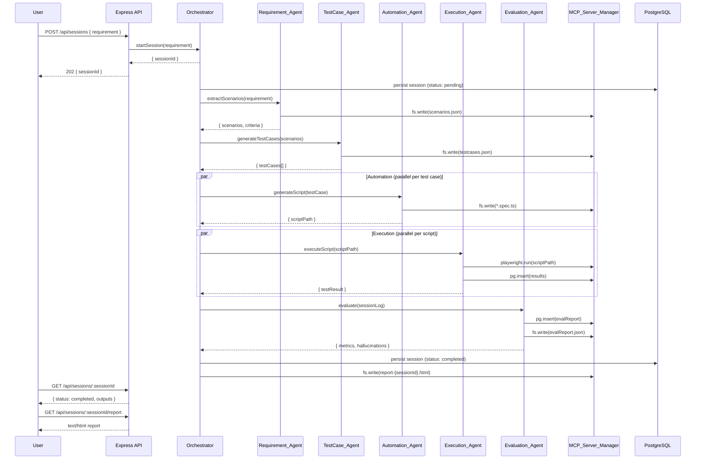

# Architecture — AI Agent & MCP Testing Framework

## 1. System Design

The framework transforms a single natural-language requirement into a fully
executed Playwright test suite, structured evaluation report, and observability
dashboard — without manual intervention.

### Technology Stack

| Concern | Technology |
|---|---|
| Runtime | Node.js 20 LTS |
| Language | TypeScript 5 (strict mode) |
| Agent Orchestration | LangGraph (`@langchain/langgraph`) |
| Browser Automation | Playwright (via MCP Server) |
| LLM Client | OpenAI-compatible (`openai` SDK) |
| Web Framework | Express.js |
| Database | PostgreSQL 15 |
| Testing | Vitest |
| Property Testing | fast-check |
| LLM Evaluation | Promptfoo |
| Containerisation | Docker + Docker Compose |
| MCP Integration | `@modelcontextprotocol/sdk` |

### Component Responsibilities

| Component | Responsibility |
|---|---|
| `OrchestratorAgent` | Session management; LangGraph state machine; sub-agent coordination |
| `RequirementAgent` | Raw requirement → structured scenarios + acceptance criteria |
| `TestCaseAgent` | Scenarios → positive / negative / edge test cases |
| `AutomationAgent` | Test cases → Playwright TypeScript scripts (POM pattern) |
| `ExecutionAgent` | Playwright execution; artifact collection; structured results |
| `EvaluationAgent` | Metric computation; hallucination detection; evaluation report |
| `MCPServerManager` | Connection, discovery, retry, timeout, schema validation for MCP servers |
| `MCPTestingFramework` | Contract, schema, security, and concurrency testing of MCP tools |
| `AgentEvaluationFramework` | Reusable metric evaluation across sessions |
| `ReportGenerator` | Self-contained HTML session reports |
| Observability Dashboard | Web UI: session list, drill-down, time-series charts |
| Express REST API | `POST /api/sessions`, `GET /api/sessions/:id`, report endpoint |

---

## 2. High-Level Architecture Diagram



---

## 3. End-to-End Sequence Diagram



---

## 4. Folder Structure

```
ai-qa-agent/
├── src/
│   ├── agents/
│   │   ├── orchestrator/
│   │   │   ├── index.ts          # OrchestratorAgent
│   │   │   ├── graph.ts          # LangGraph StateGraph
│   │   │   └── state.ts          # PipelineState type + factory
│   │   ├── requirement/
│   │   │   └── index.ts          # RequirementAgent
│   │   ├── testcase/
│   │   │   └── index.ts          # TestCaseAgent
│   │   ├── automation/
│   │   │   ├── index.ts          # AutomationAgent
│   │   │   └── pom-template.ts   # POM template generator
│   │   ├── execution/
│   │   │   └── index.ts          # ExecutionAgent
│   │   └── evaluation/
│   │       └── index.ts          # EvaluationAgent
│   ├── mcp/
│   │   ├── manager/
│   │   │   ├── index.ts          # MCPServerManager
│   │   │   ├── connection.ts     # MCPConnection
│   │   │   ├── registry.ts       # ToolRegistry
│   │   │   └── retry.ts          # Exponential backoff utility
│   │   └── testing/
│   │       ├── index.ts          # MCPTestingFramework
│   │       ├── contract.ts       # ContractValidator
│   │       ├── schema.ts         # SchemaValidator
│   │       ├── security.ts       # SecurityTester
│   │       └── concurrency.ts    # ConcurrencyTester
│   ├── evals/
│   │   ├── index.ts              # AgentEvaluationFramework
│   │   ├── metrics.ts            # Pure metric functions
│   │   ├── hallucination.ts      # HallucinationDetector
│   │   └── deepeval.ts           # DeepEval/Promptfoo adapter
│   ├── api/
│   │   ├── server.ts             # Express app factory
│   │   ├── routes/
│   │   │   ├── sessions.ts       # Session + dashboard endpoints
│   │   │   └── reports.ts        # Report download endpoint
│   │   └── middleware/
│   │       ├── error.ts          # Global error handler
│   │       └── logger.ts         # Request logger
│   ├── dashboards/
│   │   ├── server.ts             # Dashboard router
│   │   └── public/
│   │       ├── index.html        # SPA shell
│   │       ├── charts.js         # Chart.js rendering
│   │       └── styles.css        # Styles
│   ├── reports/
│   │   └── generator.ts          # HTML report builder
│   ├── logging/
│   │   ├── logger.ts             # ILogger + ConsoleLogger
│   │   └── persistence.ts        # PostgreSQL log writer
│   ├── db/
│   │   ├── client.ts             # pg Pool wrapper
│   │   └── migrations/
│   │       └── 001_initial.sql   # Initial schema
│   ├── shared/
│   │   ├── types.ts              # All shared interfaces
│   │   └── config.ts             # Environment variable loader
│   └── index.ts                  # Application entry point
├── tests/
│   ├── unit/                     # Vitest unit tests
│   └── integration/
│       └── mcp/                  # Real-MCP integration tests
├── evals/
│   └── fixtures/                 # Sample logs + reference data
├── docs/
│   └── architecture.md           # This file
├── docker/
│   ├── Dockerfile                # Multi-stage production image
│   └── init.sql                  # PostgreSQL init (copy of 001_initial.sql)
├── reports/                      # Runtime HTML report output
├── workspace/                    # File System MCP workspace
├── .github/
│   └── workflows/
│       └── ci.yml                # GitHub Actions CI pipeline
├── .husky/
│   ├── pre-commit                # lint-staged
│   └── commit-msg                # commitlint
├── docker-compose.yml            # Full stack (dev)
├── docker-compose.test.yml       # Infrastructure only (CI)
├── .env.example                  # Documented env template
├── .gitignore
├── .prettierrc
├── .prettierignore
├── eslint.config.js
├── tsconfig.json
├── tsconfig.test.json
├── vitest.config.ts
└── package.json
```

---

## 5. Implementation Roadmap

| Phase | Name | Objectives | Key Deliverables |
|---|---|---|---|
| 1 | Architecture & Setup | Document system design; scaffold project | `docs/architecture.md`, `package.json`, `tsconfig.json`, `docker-compose.yml`, `.env.example`, `README.md` |
| 2 | MCP Server Manager | MCP connections, tool discovery, retry, schema validation | `src/mcp/manager/` (retry, registry, connection, manager) |
| 3 | Single-Agent MVP | Logger, RequirementAgent, Orchestrator, REST API | `src/logging/`, `src/agents/requirement/`, `src/agents/orchestrator/`, `src/api/` |
| 4 | Full Multi-Agent Pipeline | All 5 agents wired into LangGraph state machine | `src/agents/testcase/`, `src/agents/automation/`, `src/agents/execution/`, `src/agents/evaluation/`, `src/agents/orchestrator/graph.ts` |
| 5 | MCP Testing Framework | Contract, schema, security, concurrency testing | `src/mcp/testing/` |
| 6 | Agent Evaluation Framework | Metrics, hallucination detection, DeepEval adapter | `src/evals/` |
| 7 | Observability & Reports | Dashboard UI, metric charts, HTML report generation | `src/dashboards/`, `src/reports/` |
| 8 | CI/CD & Quality | Coverage ≥ 80%, integration tests, Docker image, CI pipeline | `.github/workflows/ci.yml`, `docker/Dockerfile`, `evals/fixtures/` |
